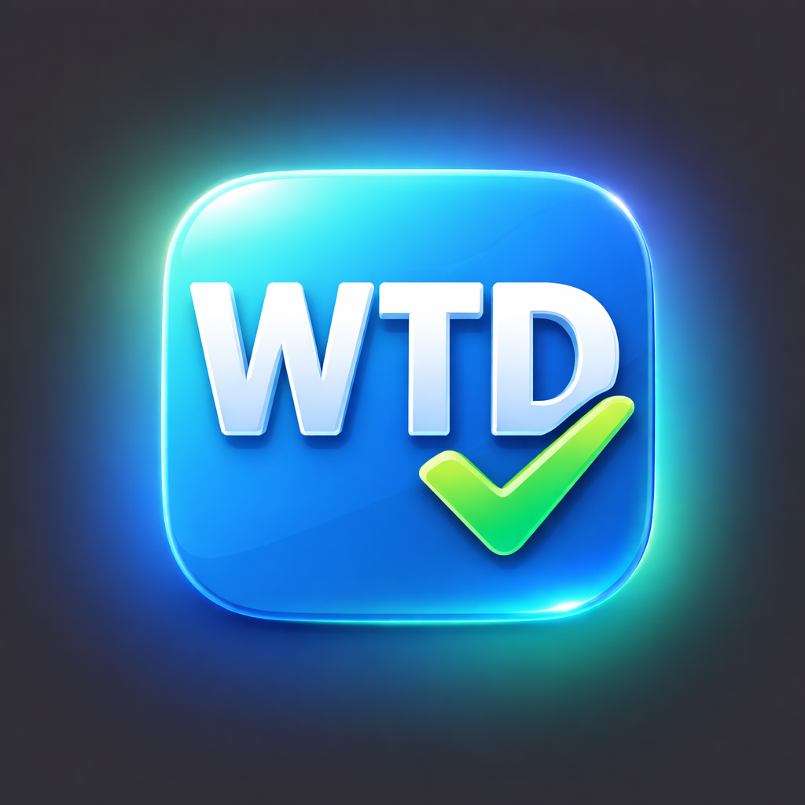

<p align="center">
  
</p>

<h1 align="center">WTD — What To Do</h1>

<p align="center">
  A local-first personal Kanban desktop app.<br/>
  Built with Electron, React, TypeScript, and SQLite.
</p>

<p align="center">
  
  
  
  
  
  
</p>

---

## Why WTD?

Most task managers live in the cloud, sync across devices, and demand accounts. WTD takes the opposite approach: **your data stays on your machine**, in a single SQLite file. No accounts, no servers, no subscriptions — just a clean board to plan your day.

## Features

- **Four fixed columns** — Backlog, Today, Doing, Done — designed for a daily workflow
- **Drag and drop** — move and reorder cards across columns with smooth animations
- **Inline quick-add** — create tasks directly inside any column
- **Task details** — title, notes, tags, priority (None / Low / Medium / High), and effort points (0–5)
- **Tag and priority filtering** — focus on what matters right now
- **Archive and restore** — sweep completed tasks out of sight, bring them back when needed
- **JSON export / import** — back up your board or move data between machines (merge or full replace)
- **Offline by design** — everything runs locally with zero network calls
- **Dark-themed UI** — a polished, glassmorphism-inspired interface that's easy on the eyes

## Tech Stack

| Layer | Technology |
|---|---|
| Desktop shell | [Electron 36](https://www.electronjs.org/) |
| UI | [React 19](https://react.dev/) + TypeScript 5 |
| Build | [Vite 6](https://vite.dev/) |
| Drag & drop | [@dnd-kit](https://dndkit.com/) |
| Database | [better-sqlite3](https://github.com/WiseLibs/better-sqlite3) |
| Validation | [Zod](https://zod.dev/) |
| Packaging | [electron-builder](https://www.electron.build/) |

## Getting Started

### Prerequisites

- **Node.js** >= 18
- **npm** >= 9
- **Python 3** and a C++ toolchain (required by `better-sqlite3` native compilation)
  - macOS: Xcode Command Line Tools (`xcode-select --install`)

### Install

```bash
git clone https://github.com/aminmovahed-db/WTD.git
cd WTD
npm install
```

### Run in Development

```bash
npm run dev
```

This starts the Vite dev server, watches the Electron TypeScript files, rebuilds `better-sqlite3` for Electron, and launches the app — all concurrently.

### Run Tests

```bash
npm test            # single run (Vitest)
npm run test:watch  # watch mode
```

## Building for Production

### Compile renderer + main process

```bash
npm run build
```

### Package a macOS DMG

```bash
npm run dist:mac
```

The installer is written to the `release/` directory.

> **Tip:** To customise the app icon, place `icon.icns` in the `build/` folder before packaging.

## Releasing a New Version

### 1. Switch to `dev` and make sure everything is clean

```bash
git checkout dev
git pull
npm test
```

### 2. Bump the version

Pick the bump level that matches your changes:

```bash
npm version patch   # bug fixes         — 0.1.0 → 0.1.1
npm version minor   # new features      — 0.1.0 → 0.2.0
npm version major   # breaking changes  — 0.1.0 → 1.0.0
```

This does three things automatically:
- Updates `"version"` in `package.json`
- Creates a git commit (`v0.1.1`)
- Creates a git tag (`v0.1.1`)

### 3. Merge into `main` and push

```bash
git checkout main
git merge dev
git push origin main --tags
```

### 4. Build the distributable

```bash
npm run dist:mac
```

The DMG is written to the `release/` directory.

### 5. Add release notes

Update the **Release Notes** section at the bottom of this README, then commit:

```bash
git add README.md
git commit -m "docs: add release notes for vX.Y.Z"
git push
```

### Where the version appears

| Location | How it gets there |
|---|---|
| `package.json` `"version"` | Set by `npm version` |
| About modal (in-app) | Read at runtime via `app.getVersion()` |
| macOS `Info.plist` (`CFBundleVersion`) | Set by electron-builder from `package.json` at build time |
| README badge | **Manual** — update the badge URL after bumping |

---

## Project Structure

```
WTD/
├── electron/                  # Electron main process
│   ├── main.ts                #   window creation, IPC handlers
│   └── preload.ts             #   context bridge (kanbanApi)
├── src/
│   ├── main/db/               # SQLite data layer
│   │   ├── index.ts           #   database init
│   │   ├── migrate.ts         #   schema migrations
│   │   ├── taskRepo.ts        #   CRUD operations
│   │   ├── exportImport.ts    #   JSON export / import
│   │   └── validation.ts      #   Zod schemas
│   ├── renderer/              # React front-end
│   │   ├── App.tsx            #   root component + DnD logic
│   │   ├── components/        #   Board, Column, TaskCard, …
│   │   ├── styles/app.css     #   global styles
│   │   └── utils/             #   tag colour helpers
│   └── shared/
│       └── types.ts           # shared TypeScript interfaces
├── tests/
│   ├── unit/                  # validation, tagColors, export/import
│   ├── integration/           # taskRepo, migrations
│   └── e2e/                   # manual smoke-test checklist
├── build/                     # app icons for packaging
├── index.html                 # HTML entry point
├── vite.config.ts
├── tsconfig.json
└── tsconfig.electron.json
```

## Data Storage

Your tasks are stored in a single SQLite file inside the platform's user data directory:

| Platform | Location |
|---|---|
| macOS | `~/Library/Application Support/wtd-desktop/kanban.db` |
| Linux | `~/.config/wtd-desktop/kanban.db` |
| Windows | `%APPDATA%\wtd-desktop\kanban.db` |

Back up this file to preserve your board, or use the built-in **Export JSON** feature.

## Contributing

Contributions are welcome! To get started:

1. Fork the repository
2. Create a feature branch (`git checkout -b feature/my-feature`)
3. Make your changes and add tests where applicable
4. Run `npm test` to verify everything passes
5. Commit your changes and open a pull request

Please keep PRs focused — one feature or fix per pull request.

## Roadmap

- [ ] Recurring tasks
- [ ] Keyboard shortcuts
- [ ] Multi-board support
- [ ] Windows & Linux packaging
- [ ] Auto-updater

## License

[MIT](LICENSE)

## Release Notes

### 0.1.0

- Initial release
- Fixed packaged macOS app blank screen by using relative renderer asset paths (`base: './'` in Vite config)
- Verified packaged app behaviour with manual smoke checks (persistence, drag/drop, archive/restore, export/import, and layout stress)
